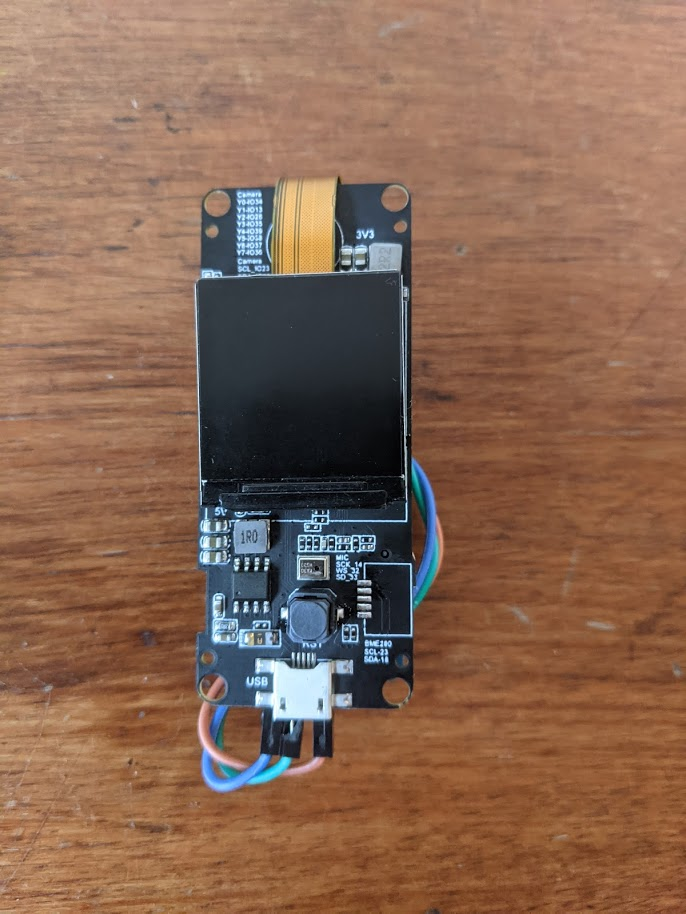
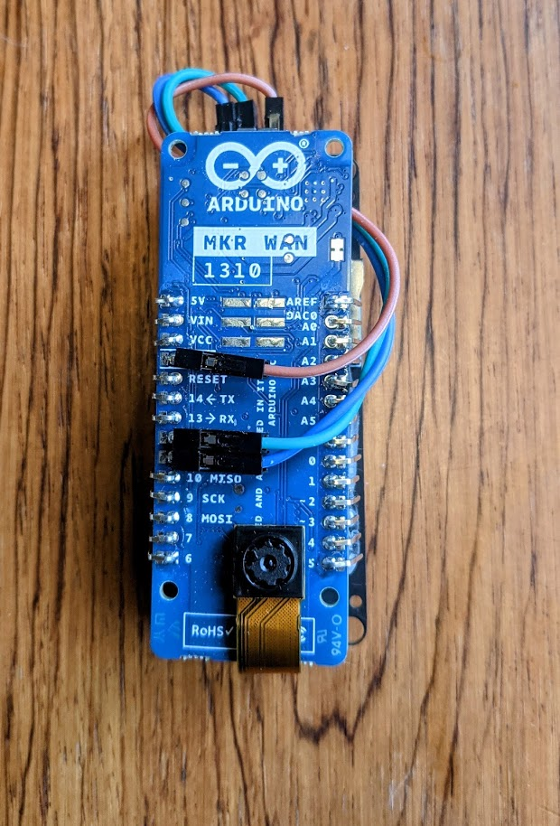

# ESP32 Scailable KPN Things Demo

### Connect the ESP32 TTGO Camera Plus with the Arduino MKR WAN 1310 over I2C

|  |  |
| ------------------------------------------------------------ | ------------------------------------------------------------ |


```

ESP32 TTGO Camera Plus          Arduino MKR WAN 1310

Ground                  <--->   Ground
SDA                     <--->   SDA
SCL                     <--->   SCL

```


### Install ESP32 Scailable Runtime firmware

Flash `ttgocameraplus.bin`, `bootloader.bin` and `partition-table.bin` to the ESP32 using:

https://github.com/espressif/esptool

On boot, our code will run a version of the emotion detection model (available at https://cdn.sclbl.net:8000/file/a3dc49b2-b01b-11eb-af86-9600004e79cc.wasm, here integrated into the binary).

The application then retrieves a frame from the ESP32's camera, runs it through the model, and sends the prediction over I2C to the Arduino MKR WAN. It will then retrieve the next frame, and so on.

### Install Arduino Arduino MKR WAN 1310 firmware

Install the Arduino IDE. Setup according to:

https://kpn-iot.github.io/thingsml-c-library/?c--arduino#installation

Compile and flash `arduino_mkrwan_slave.ino` (available [here](https://github.com/scailable/sclbl-kpn-things/tree/main/arduino_mkrwan_slave)).

The Arduino MKR WAN will now receive predictions over I2C, and send them over Lora to KPN Things!


