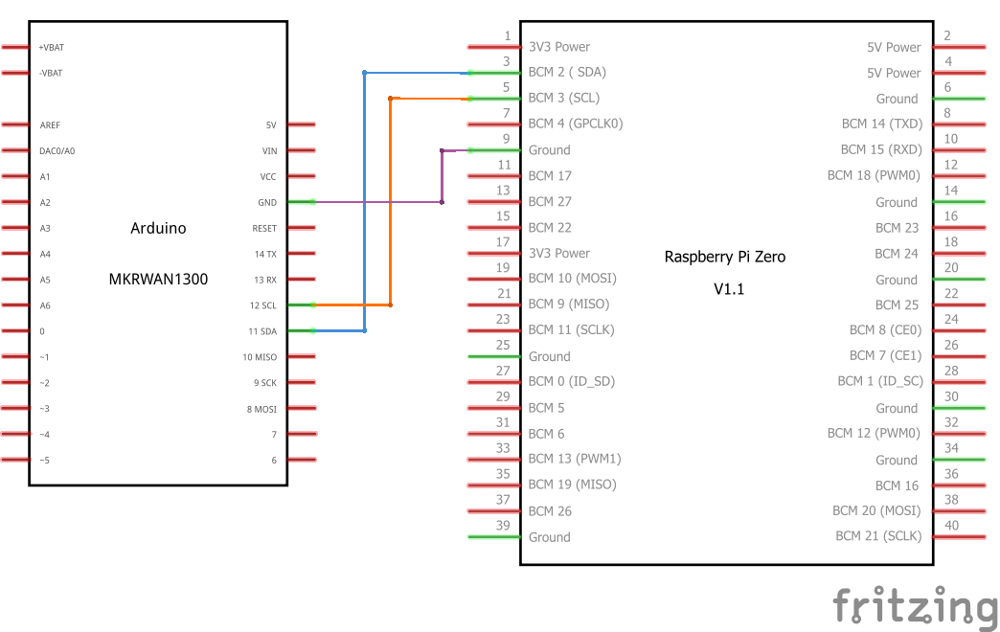
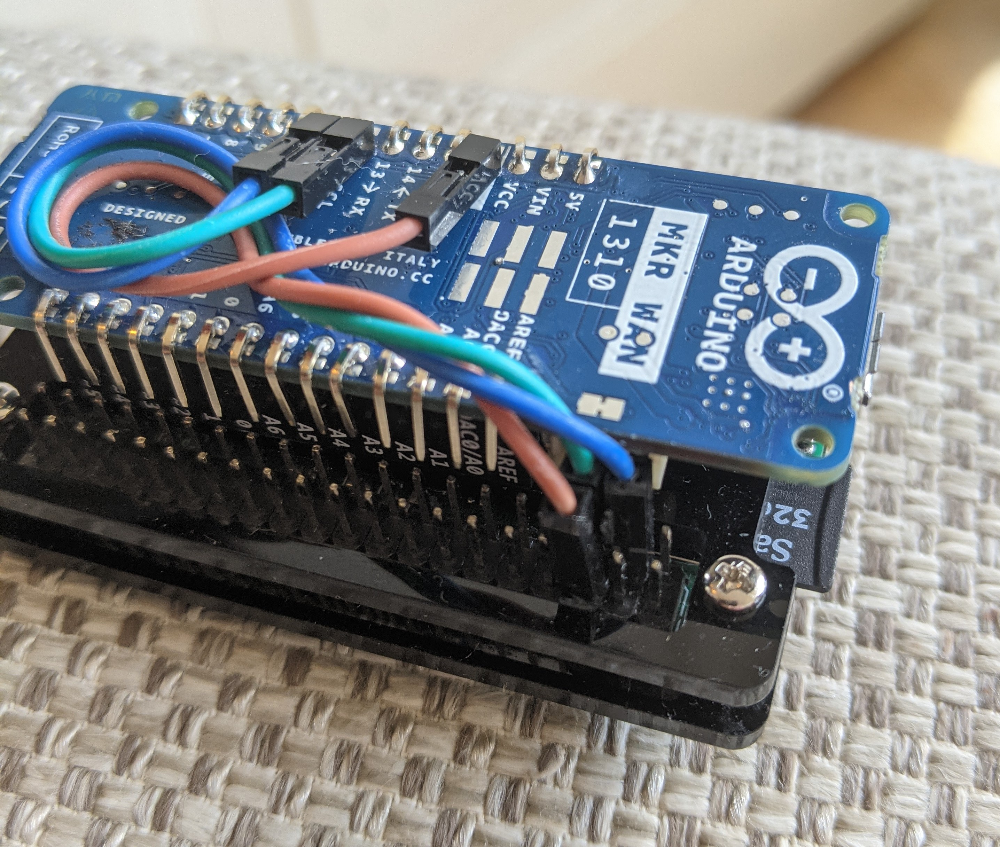

# Raspberry Pi Zero Scailable KPN Things Demo

### Connect the Pi Zero to the MKR WAN 1310 over I2C

### Create an account at Scailable, transpile ONNX

Check the Scailable tutorials: https://github.com/scailable/sclbl-tutorials.

Upload the `emotion.onnx` model to your Scailable dashboard.

### Install Raspberry Pi Zero Scailable Runtime and Client

Transfer `socket-sclbld`, `sclbl-client,` and `config.ini` to a directory on your Raspberry Pi Zero.

Do `sudo chmod +x` for `socket-sclbld` and `sclbl-client`.

### Configure, assign and run

Set a unique device id in `config.ini`. 

Set your Scailable user id in `config.ini` .

Run `socket-sclbld`. It will exit, with the message that your device is now registered, and can assign a model.

Assign the emotion model (transpiled from the uploaded `emotion.onnx`) to your device in the Scailable dashboard.

Run `socket-sclbld`. This Scailable runtime daemon now serves assigned model(s).

Run `sclbl-client`. The client sends camera input to the daemon, receives a prediction back, and communicates this prediction to the Arduino MKR WAN over I2C.

### Install Arduino Arduino MKR WAN 1310 firmware

Install the Arduino IDE. Setup according to:

https://kpn-iot.github.io/thingsml-c-library/?c--arduino#installation

Compile and flash `arduino_mkrwan_slave.ino` (available [here](https://github.com/scailable/sclbl-kpn-things/tree/main/arduino_mkrwan_slave)).

The Arduino MKR WAN will now receive predictions over I2C, and send them over Lora to KPN Things!

